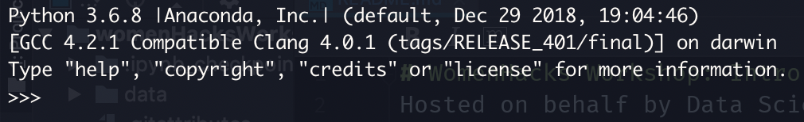
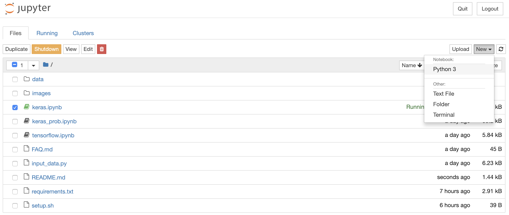

# WomenHacks Workshop: Intro to Deep Learning # 
Hosted on behalf by Data Science UCSB 

Welcome to the Deep Learning Workshop! Today we will be 
be taking you guys through a quick intro with the MNIST dataset. 

Here's step by step of what to do before we start! 

1. Download the correct version of Anaconda Python 3.6 here: https://www.anaconda.com/download/#macos

2. Install it and go through the steps 

3. Once you've completed the installation, open up terminal and execute 
`$ python`and check that on the top it says `Anaconda` like so: 
    

4. Exit Python by holding `control` and pressing `d`

5. Now let's create an anaconda virtual environment: 

    `$ conda create -n DSWorkshop python=3.6` It will prompt you to verify some package dependencies and whatnot, type `y` and hit enter. 

6. Once it's created, let's activate the environment with 

    `$ source activate DSWorkshop`

7. Now let's clone this workshop repo! Go ahead and enter this: 

    ```
    cd ~/Desktop
    git clone https://github.com/calvin-is-seksy/womenHacksWorkshop.git
    cd womenHacksWorkshop
    ```
    
8. Let's install our packages! go ahead and run 
    
    `$ conda install --yes --file requirements.txt` It will again prompt you to verify some package dependencies and whatnot, type `y` and hit enter.
    
9. We're good to go! Let's open up a jupyter notebook. Run this: 

    `$ jupyter notebook`
    
10. Let's create a new notebook! 

    
    
11. Now let's have some fun :) 
    
    